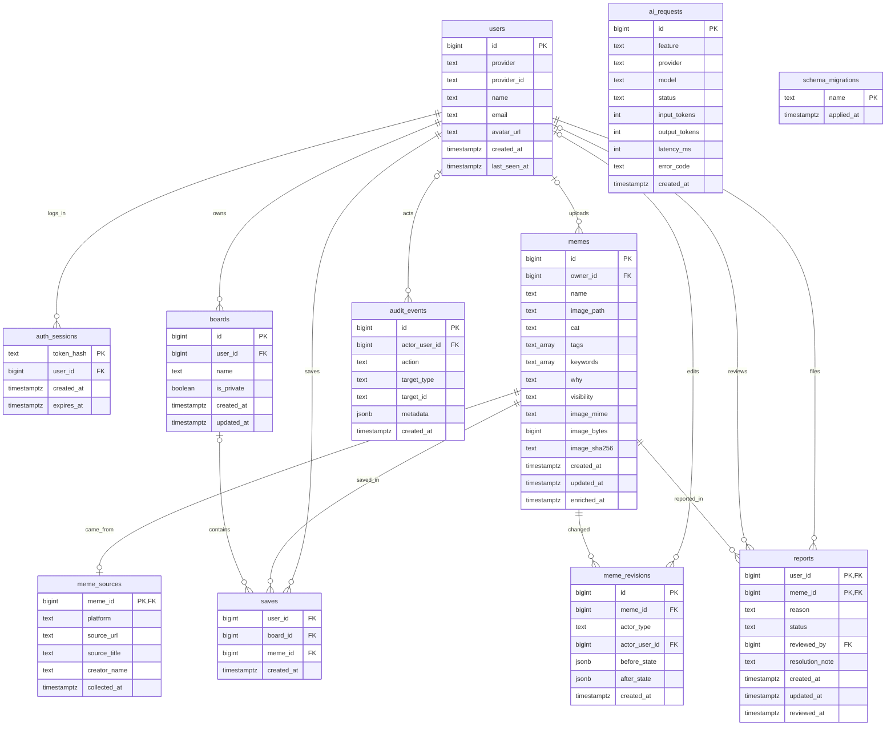

# ZZAL 데이터베이스 ERD

SAJU-M의 **기본 스키마 + 순차 마이그레이션**, **서명 쿠키의 서버측 세션**,
**AI 요청 기록**, **감사 이벤트** 방식을 참고했습니다. ZZAL의 실제 기능에
맞춰 짤 카탈로그·출처·수정 이력·저장함·신고를 모델링했습니다.



`ai_requests`는 외부 모델의 호출량과 오류만 남기며 프롬프트·이미지·API 키를
저장하지 않습니다. `audit_events.target_id`는 대상 삭제 후에도 기록을 남기려고
외래 키 대신 문자열입니다. `schema_migrations`는 데이터가 아닌 적용 이력입니다.

## 운영 규칙

- `users(provider, provider_id)`는 유일합니다. 지금은 한 소셜 계정에 한 사용자이며 비밀번호는 저장하지 않습니다.
- `auth_sessions`에는 쿠키 원문이 아닌 SHA-256 해시만 저장합니다. 로그아웃하면 해당 행을 삭제하고, 만료된 행은 새 로그인 시 정리합니다. 이 기능 도입 전에 발급한 쿠키는 다시 로그인해야 합니다.
- `memes.owner_id IS NULL`은 기본 카탈로그입니다. 업로드 짤은 소유자가 있고 기본적으로 비공개입니다. 이미지 내용은 현재 `image_path`의 data URL로 저장하며, `image_bytes`·`image_sha256`은 새 업로드부터 기록합니다.
- `meme_sources`는 **확인 가능한** Pinterest 핀 ID가 파일명에 있는 짤에만 URL을 채웁니다. 제목이나 작성자는 추측해서 기록하지 않습니다.
- `meme_revisions`는 AI 분류가 이름·분류·태그·검색어·설명을 바꿀 때 전후 값을 남깁니다. 현재 수동 편집 API는 없습니다.
- `saves`는 같은 짤을 여러 저장함에 담을 수 있습니다. `(user_id, meme_id, COALESCE(board_id, 0))`로 중복을 막고, `(board_id, user_id)` 외래 키로 남의 저장함에 넣는 것을 DB에서도 막습니다.
- `reports(user_id, meme_id)`는 한 사람당 짤 하나의 신고만 허용합니다. 재신고하면 사유와 상태를 갱신합니다. 심사 필드는 준비돼 있지만 운영자 심사 화면은 아직 없습니다.
- 사용자·짤·저장함 삭제 시 관련 저장·신고·세션은 함께 삭제됩니다. 감사 로그의 사용자 연결은 `NULL`로 바뀌며 행동 기록은 남습니다.

## 적용과 확인

새 PostgreSQL 볼륨에는 [schema.sql](../server/src/db/schema.sql)이 먼저 적용됩니다.
기존 볼륨과 새 볼륨 모두 백엔드 시작 시
[001_operational.sql](../server/src/db/migrations/001_operational.sql)이 한 번 실행됩니다.
추가 마이그레이션은 번호를 올린 새 SQL 파일로 만들고, 적용한 파일은 수정하지 않습니다.
실서버 적용 전에는 `pg_dump -Fc` 백업을 만드세요.

```sh
docker compose exec -T db psql -U zzal -d zzal -Atc "SELECT name FROM schema_migrations ORDER BY name"
docker compose exec -T db psql -U zzal -d zzal -Atc "SELECT count(*) FROM memes"
docker compose exec -T db psql -U zzal -d zzal -Atc "SELECT count(*) FROM meme_sources"
```

기존 806개 카탈로그와 사용자가 추가한 데이터는 마이그레이션에서 삭제하거나
재작성하지 않습니다. `meme_sources`만 파일명에서 확인되는 핀 URL을 채웁니다.
